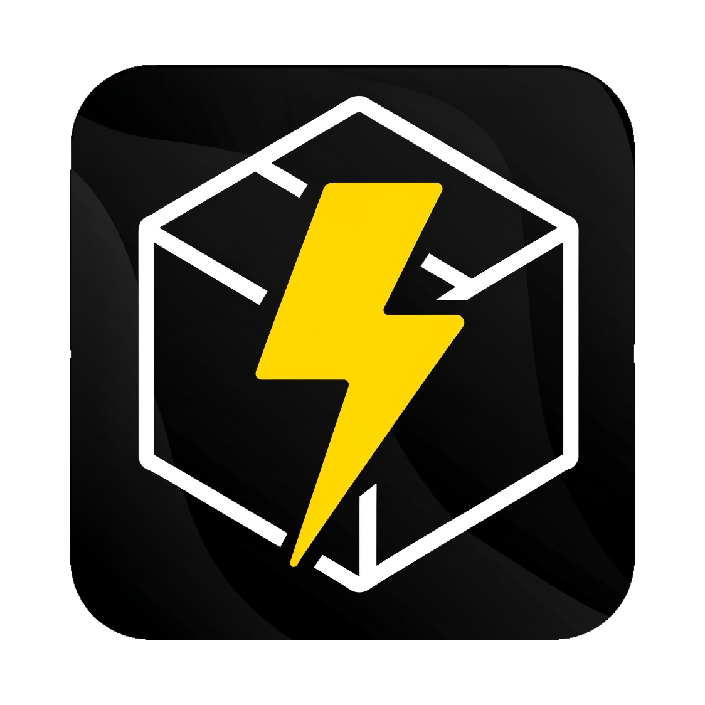

# 📦 StablePack_mobileapp

<div align="center">



**Protect your packages with Artificial Intelligence**

[](https://expo.dev)
[](https://reactnative.dev)
[](https://www.typescriptlang.org)
[](LICENSE)

*Real-time intelligent package analysis with AI-powered damage detection*

</div>

---

## 📋 Table of Contents

- [About the Project](#-about-the-project)
- [Features](#-features)
- [Technologies](#-technologies)
- [Prerequisites](#-prerequisites)
- [Installation](#-installation)
- [Configuration](#-configuration)
- [Usage](#-usage)
- [Project Structure](#-project-structure)
- [Build and Deploy](#-build-and-deploy)
- [API Backend](#-api-backend)
- [Social Authentication](#-social-authentication)
- [Contributing](#-contributing)
- [License](#-license)

---

## 🎯 About the Project

**StablePack_mobileapp** is a mobile application developed with React Native and Expo that uses Artificial Intelligence to analyze packages in real-time and detect if they are intact or damaged. The application provides a complete solution for package monitoring, including camera analysis, environmental sensors, and analysis history.

### Key Features

- 🔍 **AI Analysis**: Automatic damage detection in packages through image analysis
- 📷 **Smart Camera**: Real-time image capture and analysis
- 🌡️ **Environmental Sensors**: Temperature and humidity monitoring
- 📊 **Interactive Dashboard**: Statistics and alerts visualization
- 📱 **Cross-Platform**: Works on Android, iOS, and Web
- 🔐 **Secure Authentication**: Login, registration, and password recovery
- 🌐 **Social Login**: Support for Google, Facebook, and Apple

---

## ✨ Features

### 🔐 Authentication
- **User Registration**: Account creation with validation
- **Login**: Email and password authentication
- **Password Recovery**: Recovery via email
- **Social Login**: Integration with Google, Facebook, and Apple

### 📷 Package Analysis
- **Image Capture**: Use of device camera
- **AI Analysis**: Image sent to backend with ML model
- **Real-Time Results**: Immediate status (Intact/Damaged)
- **History**: Storage of all performed analyses

### 📊 Dashboard
- **Overview**: Statistics of analyzed packages
- **Recent Alerts**: Notifications of damaged packages
- **Sensors**: Temperature and humidity monitoring
- **Package Status**: Visualization of current package state

### ⚙️ Settings
- **User Profile**: Personal data management
- **Preferences**: Application settings
- **Notifications**: Alert controls

---

## 🛠️ Technologies

### Core
- **[Expo](https://expo.dev)** ~54.0.33 - Framework for React Native development
- **[React Native](https://reactnative.dev)** 0.81.5 - Cross-platform mobile framework
- **[React](https://react.dev)** 19.1.0 - JavaScript library for interfaces
- **[TypeScript](https://www.typescriptlang.org)** 5.9.2 - Typed JavaScript superset

### Navigation and Routing
- **[Expo Router](https://docs.expo.dev/router/introduction/)** ~6.0.23 - File-based routing
- **[React Navigation](https://reactnavigation.org)** 7.x - Screen navigation

### UI and Animations
- **[React Native Reanimated](https://docs.swmansion.com/react-native-reanimated/)** ~4.1.1 - High-performance animations
- **[React Native Gesture Handler](https://docs.swmansion.com/react-native-gesture-handler/)** ~2.28.0 - Native gestures
- **[Expo Linear Gradient](https://docs.expo.dev/versions/latest/sdk/linear-gradient/)** ~15.0.8 - Linear gradients

### Camera and Media
- **[Expo Camera](https://docs.expo.dev/versions/latest/sdk/camera/)** ~17.0.10 - Device camera access
- **[Expo Image](https://docs.expo.dev/versions/latest/sdk/image/)** ~3.0.11 - Optimized image component

### Fonts
- **[Archivo](https://fonts.google.com/specimen/Archivo)** - Main font (900 Black)
- **[Poppins](https://fonts.google.com/specimen/Poppins)** - Secondary font (multiple weights)

### Other Libraries
- **Expo Clipboard** - Clipboard management
- **Expo Haptics** - Haptic feedback
- **React Native SVG** - SVG rendering
- **React Native Safe Area Context** - Device safe areas

---

## 📦 Prerequisites

Before starting, make sure you have installed:

- **[Node.js](https://nodejs.org/)** (version 18 or higher)
- **[npm](https://www.npmjs.com/)** or **[yarn](https://yarnpkg.com/)**
- **[Expo CLI](https://docs.expo.dev/get-started/installation/)**
- **[Git](https://git-scm.com/)**

### For mobile development:
- **Android Studio** (for Android emulator)
- **Xcode** (for iOS simulator - macOS only)

---

## 🚀 Installation

1. **Clone the repository**
   ```bash
   git clone https://github.com/Marcos-exe/StablePack_mobileapp.git
   cd StablePack_mobileapp
   ```

2. **Install dependencies**
   ```bash
   npm install
   ```

3. **Start the development server**
   ```bash
   npm start
   # or
   npx expo start
   ```

4. **Choose platform**
   - Press `a` to open on Android
   - Press `i` to open on iOS
   - Press `w` to open in browser
   - Scan the QR code with Expo Go app (physical device)

---

## ⚙️ Configuration

### Backend API Configuration

Edit the `lib/api.ts` file and update the API base URL:

```typescript
export const API_BASE_URL = 'http://your-server:8000';
```

### Environment Variables

Create a `.env` file in the project root (optional):

```env
API_BASE_URL=http://your-server:8000
```

### App Configuration

Main settings are in `app.json`:

- **App Name**: `StablePack`
- **Package Name**: `com.solvex.stablepack`
- **Version**: `1.0.0`
- **New Architecture**: Enabled (required by React Native Reanimated)

---

## 📱 Usage

### Main Flow

1. **Splash Screen**: Initial screen with logo (2 seconds)
2. **Welcome Screens**: Welcome screens explaining the app
3. **Authentication**: User login or registration
4. **Dashboard**: Main screen with statistics and sensors
5. **Camera**: Package analysis via camera
6. **History**: View previous analyses
7. **Settings**: App and profile adjustments

### Package Analysis

1. Navigate to the **Camera** screen
2. Allow camera access when requested
3. Point the camera at the package
4. Capture the image
5. Wait for AI analysis
6. View the result (Intact/Damaged)

---

## 📁 Project Structure

```
StablePack_mobileapp/
├── app/                      # Screens and routes (Expo Router)
│   ├── _layout.tsx          # Root application layout
│   ├── (tabs)/              # Tab group
│   │   ├── _layout.tsx      # Tab layout
│   │   ├── index.tsx        # Initial screen
│   │   └── explore.tsx      # Exploration screen
│   ├── splash.tsx           # Splash screen
│   ├── welcome.tsx          # Welcome screen 1
│   ├── welcome2.tsx         # Welcome screen 2
│   ├── welcome3.tsx         # Welcome screen 3
│   ├── login.tsx            # Login screen
│   ├── signin.tsx           # Registration screen
│   ├── forgot-password.tsx  # Password recovery
│   ├── dashboard.tsx        # Main dashboard
│   ├── camera.tsx           # Camera/analysis screen
│   ├── history.tsx         # Analysis history
│   └── settings.tsx        # Settings
├── assets/                  # Static resources
│   ├── images/             # Images and icons
│   └── icons/              # SVG icons
├── components/              # Reusable components
│   ├── AnimatedCard.tsx    # Animated card
│   ├── SplashScreen.tsx    # Splash component
│   ├── themed-text.tsx     # Themed text
│   └── themed-view.tsx     # Themed view
├── lib/                     # Libraries and utilities
│   ├── api.ts              # API configuration
│   └── socialAuth.ts       # Social authentication
├── hooks/                   # Custom hooks
│   ├── use-color-scheme.ts # Theme hook
│   └── use-theme-color.ts  # Color hook
├── constants/               # Constants
│   └── theme.ts            # Theme configuration
├── app.json                 # Expo configuration
├── eas.json                 # EAS Build configuration
├── package.json             # Project dependencies
└── README.md               # This file
```

---

## 🏗️ Build and Deploy

### Development Build

```bash
# Android
eas build --profile development --platform android

# iOS
eas build --profile development --platform ios
```

### Preview Build (APK/IPA)

```bash
# Android APK
eas build --profile preview --platform android

# iOS
eas build --profile preview --platform ios
```

### Production Build

```bash
# Android
eas build --profile production --platform android

# iOS
eas build --profile production --platform ios
```

### Store Submission

```bash
# Android (Google Play)
eas submit --platform android

# iOS (App Store)
eas submit --platform ios
```

> **Note**: You need an EAS account and be authenticated. Run `eas login` before building.

---

## 🔌 API Backend

The app requires a backend API to function completely. See the `API_ENDPOINT_GUIDE.md` file for details on required endpoints.

### Main Endpoints

#### Authentication
- `POST /auth/register` - User registration
- `POST /auth/login` - Login
- `POST /auth/recoverPassword` - Password recovery
- `POST /auth/resetPassword` - Password reset

#### Package Analysis
- `POST /package/analyze` - Package image analysis

#### Social Authentication
- `POST /auth/social/google` - Login with Google
- `POST /auth/social/facebook` - Login with Facebook
- `POST /auth/social/apple` - Login with Apple

> **Important**: Configure the API URL in `lib/api.ts` before using the app.

---

## 🌐 Social Authentication

The app supports social authentication with Google, Facebook, and Apple. See the `SOCIAL_AUTH_GUIDE.md` file for detailed instructions.

### Backend Requirements

The backend needs to implement social authentication endpoints that:
1. Receive the provider token (Google/Facebook/Apple)
2. Validate the token with the provider
3. Create/update user in database
4. Return a JWT token from your API

---

## 🎨 Design and UI

The app uses:
- **Design System**: Based on reusable components
- **Dark Theme**: Dark-themed interface by default
- **Smooth Animations**: Animations with React Native Reanimated
- **SVG Icons**: Scalable vector icons
- **Custom Fonts**: Archivo and Poppins from Google Fonts

---

## 🧪 Development

### Available Scripts

```bash
# Start development server
npm start

# Start on Android
npm run android

# Start on iOS
npm run ios

# Start in browser
npm run web

# Run linter
npm run lint
```

### Route Structure

The project uses **Expo Router** with file-based routing:
- Files in `app/` automatically become routes
- `_layout.tsx` defines layouts
- `(tabs)` creates a tab group
- `index.tsx` is the default route

---

## 🐛 Troubleshooting

### Common Issues

**Android build error with image files**
- Make sure image file names don't contain hyphens
- Use underscores (`_`) instead of hyphens (`-`)

**New architecture error**
- `react-native-reanimated` requires `newArchEnabled: true` in `app.json`
- Don't disable the new architecture if using Reanimated

**Dependency version errors**
- Run `npx expo install --check` to check compatibility
- Use `npx expo install <package>` to install compatible versions

**API issues**
- Check if the API URL is correct in `lib/api.ts`
- Make sure the backend is running and accessible
- Check CORS permissions on the backend

---

## 📝 License

This project is private and proprietary. All rights reserved.

---

## 👥 Contributing

This is a private project. For contributions, contact the development team.

---

## 📞 Support

For questions and support:
- Check Expo documentation: https://docs.expo.dev
- Check project guides: `API_ENDPOINT_GUIDE.md` and `SOCIAL_AUTH_GUIDE.md`

---

<div align="center">

**Developed with ❤️ using Expo and React Native**

[Expo](https://expo.dev) • [React Native](https://reactnative.dev) • [TypeScript](https://www.typescriptlang.org)

</div>
